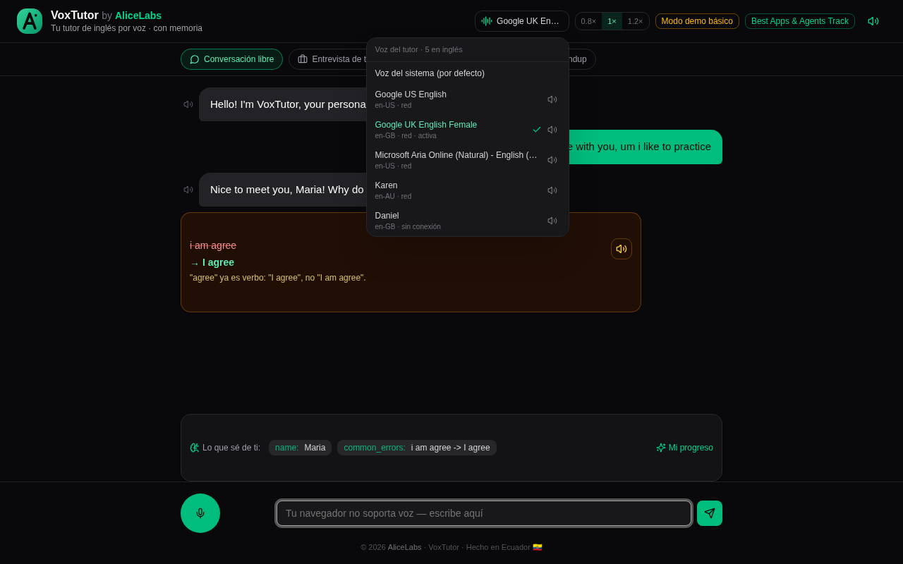
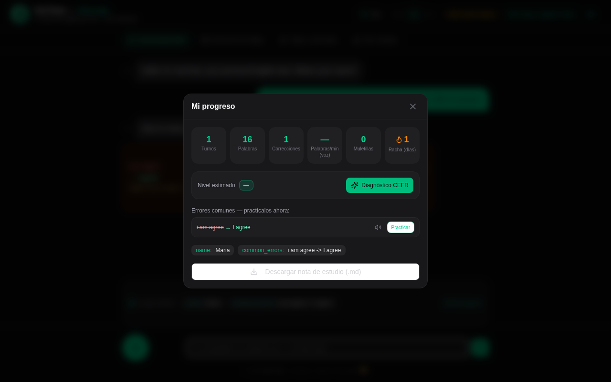

<div align="center">


# VoxTutor

**A voice-first English tutor that remembers who you are.**

*by AliceLabs* · Made in Ecuador 🇪🇨

**Live demo:** https://alicelabs-voxtutor.vercel.app


</div>

---

**VoxTutor** is a conversational English tutor for Spanish speakers. You talk to it with your microphone, it replies out loud, corrects your grammar mistakes live (explained in Spanish), and **remembers you across sessions** — your name, your goal, your level, and the mistakes you make most often — so it can reintroduce them in context until you master them.

Most language apps start from zero every single day. VoxTutor doesn't: the persistent student profile is a first-class part of the product, not a session artifact.

## 📸 Screenshots

| Voice picker & corrections | CEFR progress panel |
|---|---|
|  |  |

*Every English voice installed in the browser is switchable with one tap (preview included) — and the CEFR panel tracks your level, streaks, speaking pace (WPM), filler-word count and 4-week roadmap.*

## ✨ What makes it different

- **End-to-end voice** — speak with your mic (Web Speech API: `SpeechRecognition`) and the tutor answers out loud (`speechSynthesis` TTS), with a **switchable voice picker** (every English voice installed in the browser, grouped by accent — US/UK/AU/IN — with one-tap preview, and the mic follows the selected accent), adjustable speaking speed (0.8× beginner / 1× / 1.2× challenge), replay-audio on every correction, and a live audio-wave visualizer. A text-input fallback keeps the app usable in browsers without speech support.
- **Practice scenarios** — one click switches the tutor between **Job Interview** (behavioral questions, STAR method, salary negotiation), **Travel & Daily Life** (airport, hotel, emergencies roleplay), **Tech Daily Standup** (yesterday/today/blockers) and free conversation. A real employability trainer, not a generic chatbot.
- **Live corrections without breaking the flow** — one grammar fix per turn, explained kindly in the learner's native language, delivered as a readable card with a replay-pronunciation button.
- **Deep CEFR diagnosis (multi-model routing)** — everyday voice turns run on a fast model; a "CEFR Diagnosis" button sends the full session history to a deep reasoning model that classifies the CEFR level, extracts recurring error patterns and builds a 4-week personalized study roadmap.
- **Progress panel & exportable study note** — live CEFR level, session metrics (turns, words, corrections, practice streak), interactive error list with "Practice this error now" buttons, and a one-click Markdown study-note export for offline review.
- **Real-world context via Tavily Search** — when the student mentions a real company ("an interview at Amazon") or a real city ("traveling to London"), VoxTutor performs a **live web search with the Tavily API** and injects current, real-world facts into the tutor's context, so practice uses today's reality instead of generic examples.
- **Persistent, per-browser memory** — everything the tutor learns (name, goal, interests, common errors) is stored server-side (Vercel Edge Config in production) and re-injected into future sessions. Each browser gets an anonymous session id in `localStorage`, so different users never see each other's data — clear your storage and you start fresh.
- **CEFR-aware teaching method** — the tutor adapts its vocabulary to the student's level and deliberately reintroduces past mistakes in new contexts.
- **Provider-agnostic LLM layer** — built to run on **NVIDIA Nemotron** served by **Nebius Token Factory**, with an offline heuristic tutor as a zero-key fallback so anyone can clone and run the demo instantly.

## ⚡ Runs on Nebius Token Factory (NVIDIA Nemotron)

This project makes a **runtime call to the Nebius Token Factory inference API**, as required by the hackathon rules — with **dual-model routing**, the exact architecture NVIDIA/Nebius recommend:

| Layer | Model (default) | Purpose |
|---|---|---|
| **Fast Voice Layer** | `nvidia/NVIDIA-Nemotron-3-Nano-30B-A3B` (30B total / **3B active**, 262K ctx) | Every voice turn — MoE with 3B active parameters keeps replies fast and credits long |
| **Deep Diagnostic Layer** | `nvidia/Nemotron-3-Ultra-550b-a55b` (550B total / 55B active, 256K ctx) | On-demand CEFR diagnosis: flagship reasoning over the full session history |

This is the exact routing the **Best Apps and Agents track** recommends: *"let Nano or Super handle the fast, everyday calls... Reach for Nemotron 3 Ultra when you need serious reasoning."* Both layers are overridable via `NEBIUS_MODEL_FAST` / `NEBIUS_MODEL_DEEP`, and if a primary model is unavailable the API client retries once with the legacy `llama-3.3-nemotron-super-49b` / `llama-3.1-nemotron-ultra-253b` models before degrading to the local heuristic tutor — **the chat never goes down.**

- **Endpoint:** `POST https://api.tokenfactory.nebius.com/v1/chat/completions`
- **Integration:** [`src/lib/llm.ts`](src/lib/llm.ts) — plain `fetch` call with `NEBIUS_API_KEY` auth; both models are overridable via `NEBIUS_MODEL_FAST` / `NEBIUS_MODEL_DEEP`
- **Structured output:** the system prompt (in [`src/lib/tutor.ts`](src/lib/tutor.ts)) forces Nemotron to answer with a strict JSON contract, parsed and defensively validated server-side:

```json
{
  "reply": "natural spoken English response",
  "corrections": [{ "wrong": "I want go", "right": "I want to go", "note": "..." }],
  "memoryUpdates": [{ "key": "goal", "value": "English for work" }]
}
```

- `reply` is spoken aloud via TTS, `corrections` renders the grammar cards, and `memoryUpdates` is merged into the persistent student profile.

**Graceful fallback:** if `NEBIUS_API_KEY` is not configured, VoxTutor runs a local heuristic tutor ([`src/lib/tutor-local.ts`](src/lib/tutor-local.ts)) instead of crashing — it detects names/goals, fixes classic Spanish-speaker mistakes (`"I want go"` → `"I want to go"`, `"goed"` → `"went"`, `"I have 20 years"` → `"I am 20 years old"`), and keeps the same memory pipeline. Judges can try the app with zero setup; adding the API key instantly upgrades it to full Nemotron intelligence (the UI badge switches from "Modo demo básico" to `mode: "nebius"`).

## 🧠 How it works

```
Browser (native ASR/TTS via Web Speech API)
        │  text + scenario
        ▼
/api/chat ──► Nemotron SUPER (fast voice layer) ◄── Tavily Search (real-world context)
        │                                                │ interview @ company
        │                                                │ travel to city
        ▼                                                ▼
/api/diagnosis ──► Nemotron ULTRA (deep reasoning)   web snippets
        │             CEFR level · error patterns        │
        ▼             4-week roadmap                     │
Vercel Edge Config ◄────────────────────────────────────┘
(persistent, per-browser student memory)
```

One read per turn (memory + history + stage + meta) and one batched write per turn (messages + memory upserts + stage + meta), with automatic pruning (max 30 messages per session) to stay well within quotas. If the store is unreachable, the chat never fails — it just skips persistence for that turn.

## 🚀 Run it locally

```bash
# 1. Install dependencies (Node 20+)
npm install

# 2. (Optional) configure environment
cp .env.example .env

# 3. Start
npm run dev
# → http://localhost:3000
```

Production build works the standard way on macOS / Linux / Windows:

```bash
npm run build
npm start
```

### Environment variables (all optional)

| Variable | Purpose |
|---|---|
| `NEBIUS_API_KEY` | Enables full NVIDIA Nemotron responses via Nebius Token Factory |
| `NEBIUS_MODEL_FAST` | Fast voice layer model (default `nvidia/llama-3.3-nemotron-super-49b-v1`) |
| `NEBIUS_MODEL_DEEP` | Deep diagnostic model (default `nvidia/llama-3.1-nemotron-ultra-253b-v1`) |
| `NEBIUS_BASE_URL` | Defaults to `https://api.tokenfactory.nebius.com/v1` |
| `TAVILY_API_KEY` | Real-world context via Tavily Search (companies/cities); optional |
| `EDGE_CONFIG_ID` / `EDGE_CONFIG_TOKEN` / `EDGE_CONFIG_TEAM_ID` | Persistent memory via Vercel Edge Config (otherwise in-memory) |

Without any variables, the app runs in demo mode with local memory — nothing to configure, nothing to pay.

> ⚠️ Microphone input requires **Chrome or Edge** served over `localhost` or HTTPS. Other browsers automatically get the text-input fallback.

## 📁 Project structure

```
src/
├── app/
│   ├── api/chat/route.ts       # Conversation turn (strict JSON contract)
│   ├── api/diagnosis/route.ts  # Deep CEFR diagnosis endpoint
│   ├── api/memory/route.ts     # Persistent student memory (per browser)
│   └── layout.tsx              # AliceLabs metadata
├── components/voice-tutor.tsx  # Full UI (scenarios, voice, progress panel)
├── lib/
│   ├── llm.ts                  # Dual-model routing: Nemotron Super (fast) + Ultra (deep)
│   ├── tavily.ts               # Tavily Search client (real-world context)
│   ├── diagnose.ts             # CEFR diagnosis (deep or local heuristic)
│   ├── tutor-local.ts          # Offline heuristic tutor + scenario banks
│   ├── store.ts                # Storage: Vercel Edge Config / in-memory
│   └── tutor.ts                # System prompt + teaching method
└── types/speech.ts             # Web Speech API typings
```

## 🏆 Context

Built by **AliceLabs** for the *Nebius x NVIDIA Global AI Hackathon* — *Best Apps & Agents* track.

- **Live demo:** https://alicelabs-voxtutor.vercel.app
- **Repository:** https://github.com/eddyflores100-lang/alicelabs-voxtutor

## 📄 License

[MIT](LICENSE) © 2026 AliceLabs

---

🌐 *Other languages:* [Español](README.es.md)
